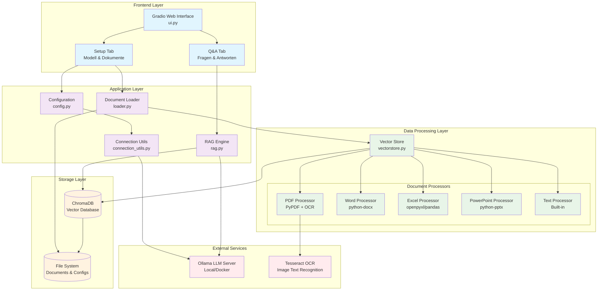

# RAG System Architektur

## Überblick

Dieses lokale RAG (Retrieval-Augmented Generation) System kombiniert Dokument-Retrieval mit Large Language Models über Ollama. Das System lädt verschiedene Dokumentformate, erstellt Vektor-Embeddings und ermöglicht intelligente Fragen über die geladenen Inhalte.

### Mermaid



### ASCII

┌─────────────────────────────────────────────────────────────┐
│                    Frontend Layer                           │
│  ┌─────────────────────────────────────────────────────┐   │
│  │           Gradio Web Interface (ui.py)              │   │
│  │  ┌─────────────────┐  ┌─────────────────────────┐  │   │
│  │  │   Setup Tab     │  │      Q&A Tab            │  │   │
│  │  │ Modell & Docs   │  │  Fragen & Antworten     │  │   │
│  │  └─────────────────┘  └─────────────────────────┘  │   │
│  └─────────────────────────────────────────────────────────┘   │
└─────────────────────────────────────────────────────────────┘
                              │
┌─────────────────────────────────────────────────────────────┐
│                  Application Layer                          │
│  ┌─────────────┐ ┌─────────────┐ ┌─────────────┐ ┌────────┐│
│  │   Config    │ │ Connection  │ │   Loader    │ │  RAG   ││
│  │  config.py  │ │   Utils     │ │  loader.py  │ │ rag.py ││
│  │             │ │connection..│ │             │ │        ││
│  └─────────────┘ └─────────────┘ └─────────────┘ └────────┘│
└─────────────────────────────────────────────────────────────┘

## System-Komponenten

### 1. **Konfigurationsverwaltung** (`config.py`)
- **Zweck**: Zentrale Konfiguration für alle System-Parameter
- **Funktionen**:
  - Verwaltung von Ollama-Verbindungseinstellungen
  - Docker-Erkennung und automatische URL-Anpassung
  - Verfügbare Modell-Liste
  - Dokumentenpfad-Verwaltung

### 2. **Verbindungsmanagement** (`connection_utils.py`)
- **Zweck**: Robuste Ollama-Verbindungsverwaltung
- **Funktionen**:
  - Retry-Mechanismus für Verbindungsfehler
  - Verbindungsstatus-Überwachung
  - Timeout-Handling
  - Detaillierte Fehlerberichterstattung

### 3. **Dokumenten-Loader** (`loader.py`)
- **Zweck**: Koordination des Dokumentenladens
- **Funktionen**:
  - Verzeichnis-basiertes Laden aller unterstützten Dateien
  - Einzeldatei-Laden mit Format-Erkennung
  - Datei-Statistiken und Übersichten
  - Integration mit Vektor-Store System

### 4. **Vektor-Store System** (`vectorstore.py`)
- **Zweck**: Dokumentenverarbeitung und Embeddings-Management
- **Funktionen**:
  - **Multi-Format-Support**:
    - PDF (mit OCR für gescannte Dokumente)
    - Word (.docx, .doc)
    - Excel (.xlsx, .xls)
    - PowerPoint (.pptx, .ppt)
    - Text/Markdown (.txt, .md)
  - **Textverarbeitung**:
    - Intelligente Chunk-Erstellung
    - OCR-Integration für Bilder/Scans
    - Metadaten-Extraktion
  - **Vektor-Store-Management**:
    - ChromaDB-Integration
    - Persistente Speicherung
    - CRUD-Operationen für Vektorspeicher

### 5. **RAG-Engine** (`rag.py`)
- **Zweck**: Frage-Antwort-System Implementation
- **Funktionen**:
  - Integration mit Ollama LLM
  - Verschiedene Chain-Typen (stuff, map_reduce, refine, map_rerank)
  - Kontext-bewusste Prompt-Templates
  - Quellen-Verfolgung für Antworten

### 6. **Benutzeroberfläche** (`ui.py`)
- **Zweck**: Gradio-basierte Web-Interface
- **Funktionen**:
  - **Setup-Tab**: Modell-Konfiguration und Dokumenten-Laden
  - **QA-Tab**: Interaktive Frage-Antwort-Sitzungen
  - **Vektorspeicher-Management**: CRUD-Operationen
  - **Status-Monitoring**: System-Gesundheit und Verbindungen

### 7. **Container-Support** (`Dockerfile`, `docker-compose.yml`)
- **Zweck**: Einfache Deployment-Optionen
- **Funktionen**:
  - Multi-Stage Docker Build
  - Automatische Dependency-Installation
  - Host-Integration für Ollama-Zugriff

## Datenfluss

```
1. Dokumenten-Upload
   ├── Dateierkennung (loader.py)
   ├── Format-spezifische Extraktion (vectorstore.py)
   ├── Text-Chunking
   └── Vektor-Embedding (ChromaDB)

2. Frage-Verarbeitung
   ├── Vektor-Suche (Retrieval)
   ├── Kontext-Zusammenstellung
   ├── LLM-Anfrage (Ollama)
   └── Antwort mit Quellen-Referenzen
```

## Technologie-Stack

- **Backend**:
  - Python 3.11+
- **LLM-Integration**:
  - [Ollama](https://ollama.com/)
  - [LangChain](https://github.com/langchain-ai/langchain) ([LangChain Python API Reference](https://python.langchain.com/api_reference/index.html))
    - [langchain-community](https://github.com/langchain-ai/langchain-community)
    - [langchain-ollama](https://github.com/langchain-ai/langchainjs/tree/main/libs/langchain-ollama)
    - [langchain-chroma](https://github.com/hwchase17/chroma-langchain)
- **Vektor-Datenbank**:
  - [ChromaDB](https://github.com/chroma-core/chroma)
- **UI-Framework**:
  - [Gradio](https://www.gradio.app/) ([GitHub](https://github.com/gradio-app/gradio))
- **Dokumentenverarbeitung**: 
  - PDF
    - [PyPDF2](https://github.com/talumbau/PyPDF2) (⚠️ sehr alter Fork von neuerem [pypdf](https://github.com/py-pdf/pypdf) -  umschwenken?)
    - [PyMuPDF](https://github.com/pymupdf/PyMuPDF)
  - Word
    - [python-docx](https://github.com/python-openxml/python-docx)
  - Excel
    - [openpyxl](https://openpyxl.readthedocs.io/en/stable/) ([GitHub](https://github.com/ericgazoni/openpyxl),⚠️ ca. 12 Jahre alt, wird aber wohl noch verwendet um Excel Dateien zu lesen)
    - [pandas](https://pandas.pydata.org/)
  - PowerPoint
    - [python-pptx](https://github.com/scanny/python-pptx/tree/master)
  - OCR
    - [pytesseract](https://github.com/h/pytesseract)
- **Containerisierung**: Docker + Docker Compose

## Architektur-Prinzipien

- **Modularität**: Jede Komponente hat klar definierte Verantwortlichkeiten
- **Erweiterbarkeit**: Neue Dateiformate können einfach hinzugefügt werden
- **Robustheit**: Umfassendes Error-Handling und Retry-Mechanismen
- **Benutzerfreundlichkeit**: Intuitive Web-Oberfläche mit Status-Feedback
- **Deployment-Flexibilität**: Native und Container-basierte Installation